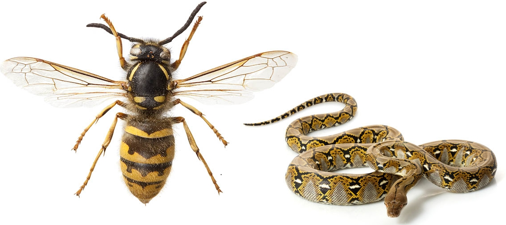

# waspy
Wing Aerostructural Studies in Python

This repo contains all the files needed to produce the results presented in Jasa et al's 2019 Aviation paper on aerostructural wing design.
We use [OpenAeroStruct](https://github.com/mdolab/OpenAeroStruct) for all studies.
